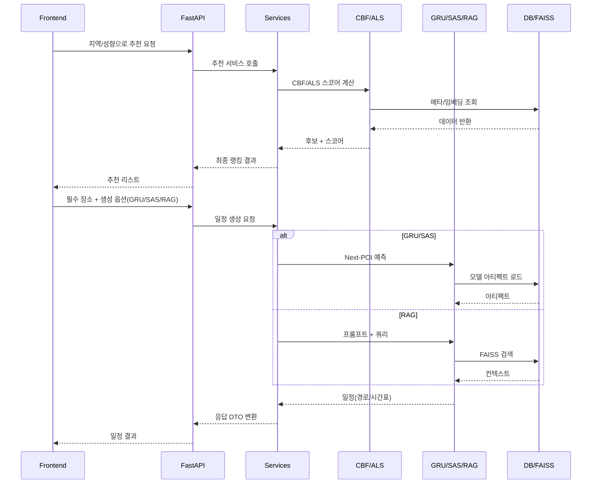

## AI 아키텍처

### 개요

InPick의 AI는 추천과 일정 생성 두 축으로 구성됩니다.

- 추천: CBF(콘텐츠 기반) + ALS(협업 필터링)를 하이브리드로 사용하여 선택 지역의 POI 후보를 랭킹합니다.
- 일정 생성: 선택된 필수 여행지와 사용자 선호를 조건으로 GRU4Rec, SASRec 기반의 Next-POI 시퀀스 모델 또는 RAG 기반 LLM 프롬프트를 통해 일정을 생성합니다.

### 오프라인/온라인 분리

- 오프라인(학습/전처리)
  - 피처/메타데이터 구축: `app/ml/contentBasedFiltering/`, `app/ml/collaborativeFiltering/`
  - 모델 학습 및 아티팩트 저장: `app/ml/artifacts/`
    - CBF 임베딩/모델: `artifacts/models--JY1211--inpick-cbf/`
    - Next-POI: `nextpoi_gru4rec.pt`, `nextpoi_sas_rec.pt`
    - RAG 인덱스: `app/rag/faiss_store/`
- 온라인(서빙)
  - FastAPI 엔드포인트: `app/api/endpoint/*.py`
  - 서비스 계층: `app/services/*`
  - 저장소 계층: `app/repositories/*`

### 데이터 소스

- PostgreSQL: 사용자, 장소 메타, 로그 등 구조화 데이터 (`app/db/postgresql.py`, `app/models/postgre_model.py`)
- MongoDB 또는 문서 저장: 캐시/세션/로그 등 (`app/db/mongo.py`)
- 파일 기반 리소스: `uploads/*.csv` (장소/지역 매핑, 풍부화 데이터)

### 추천 아키텍처

1. CBF(Content-Based Filtering)

- 입력: 사용자가 선택한 지역, 여행 성향(테마/활동), 장소 메타/카테고리
- 처리: 장소 임베딩 유사도(코사인 등), 필터(지역/카테고리), 가중 합산 리랭킹
- 구현 위치:
  - 전처리/로직: `app/contentmodel/content_based_recommendation_service.py`
  - API 노출: `app/api/endpoint/recommendation.py`, `app/api/endpoint/place.py`
- 아티팩트: `app/ml/artifacts/models--JY1211--inpick-cbf/*`

2. ALS(Matrix Factorization 기반 CF)

- 입력: 사용자-아이템 상호작용(조회, 클릭, 저장 등)과 가중치
- 처리: 잠재요인 분해로 유사 사용자/아이템 추정 → 지역 필터 → CBF 스코어와 하이브리드 결합
- 구현 위치:
  - 학습/유틸: `app/ml/collaborativeFiltering/`
  - API 래핑: `app/api/endpoint/recommendation.py`

3. 하이브리드 리랭킹

- 전략: `score = w_cbf * s_cbf + w_als * s_als + b`
- 가중치 튜닝: 사용 로그(A/B) 기반으로 `services/*` 레벨에서 조정 가능

### 일정 생성 아키텍처

옵션 A) Next-POI 시퀀스 모델(GRU4Rec/SASRec)

- 입력: 사용자의 과거 방문 시퀀스(또는 선택한 필수 여행지), 시간대/체류시간/이동비용 특성
- 처리: 다음 방문 확률 분포 예측 → 경로 제약(이동 시간, 영업시간)로 유효 경로 생성 → 일정 작성
- 구현 위치:
  - 모델: `app/ml/next_poi_gru4rec.py`, `app/ml/next_poi_sas_rec.py`
  - 아티팩트: `app/ml/artifacts/nextpoi_gru4rec.pt`, `app/ml/artifacts/nextpoi_sas_rec.pt`
  - 서비스: `app/services/generate_itinerary_service.py`, `app/services/itinerary_service.py`
  - API: `app/api/endpoint/itinerary.py`

옵션 B) RAG 기반 일정 생성

- 입력: 필수 여행지, 사용자 선호, 지역 컨텍스트
- 처리: 벡터DB(FAISS)에서 관련 문서/장소 설명을 검색 → LLM 프롬프트 구성 → 일정 생성 및 근거 텍스트 포함
- 구현 위치:
  - RAG: `app/rag/itinerary.py`
  - 인덱스: `app/rag/faiss_store/index.faiss`, `meta.json`
  - API: `app/api/endpoint/itinerary.py`

### 엔드포인트 맵

- 추천: `app/api/endpoint/recommendation.py`
- 장소: `app/api/endpoint/place.py`, `app/api/endpoint/region.py`, `app/api/endpoint/accommodation.py`
- 일정: `app/api/endpoint/itinerary.py`
- 인증: `app/api/endpoint/auth.py`, `app/auth/*`

### 서비스/저장소 계층

- 서비스: 비즈니스 규칙(가중치, 필터, 예외 처리) → `app/services/*`
- 저장소: DB 접근/쿼리 최적화 → `app/repositories/*`

### 관측/로그

- 미들웨어 로그: `app/middlewares/log_middleware.py`
- 서비스 로그: `app/services/log_service.py`, `app/services/activity_log_service.py`
- 로그 스키마: `app/schemas/log_schema.py`, `app/schemas/activity_log_schema.py`

### 배치/재학습

- 배치 데이터 갱신: `uploads/*.csv` 반영 및 ETL
- 재학습 파이프라인: `app/ml/*` 스크립트로 오프라인 갱신 → 아티팩트 교체 → 무중단 재적재(서빙 프로세스 핫스왑 또는 롤링)

### 보안/성능 고려사항

- PII 최소화, 토큰 기반 인증(`app/auth/*`)
- 추천/일정 생성 캐시, 벡터 검색 캐시(Faiss warmup)
- N+1 쿼리 방지(저장소 계층 최적화), 타임아웃/서킷 브레이커 적용 권장

### 시퀀스 다이어그램(요약)

### 환경 변수/설정(예시)

- 데이터베이스: `POSTGRES_*`, `MONGO_*`
- 모델 경로: `MODEL_DIR=app/ml/artifacts`, `RAG_INDEX_DIR=app/rag/faiss_store`
- 로깅/레벨: `LOG_LEVEL=INFO`

### 관련 코드 포인터

- 추천 CBF: `app/contentmodel/content_based_recommendation_service.py`
- Next-POI: `app/ml/next_poi_gru4rec.py`, `app/ml/next_poi_sas_rec.py`
- RAG: `app/rag/itinerary.py`
- 일정 서비스: `app/services/generate_itinerary_service.py`
- 엔드포인트: `app/api/endpoint/recommendation.py`, `app/api/endpoint/itinerary.py`
